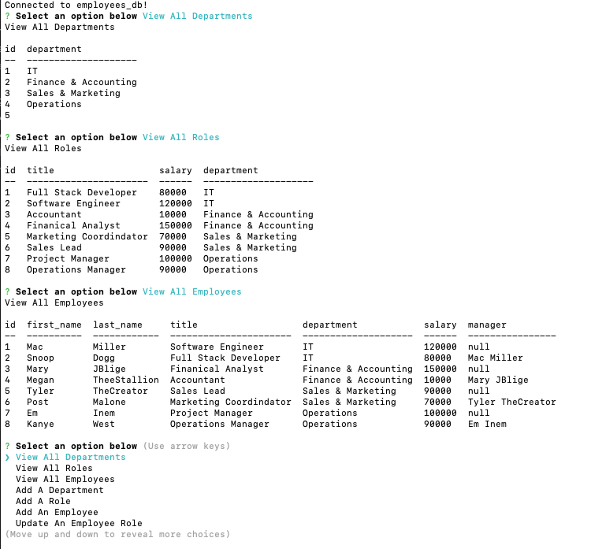

# C12_Employee_Tracker

  ## Table-of-Contents
  * [Description](#description)
  * [Installation](#installation)
  * [Usage](#usage)
  * [Contributing](#contributing)
  * [Tests](#tests)
  * [Questions](#questions)
  * [Sample](#sample)
  * [Links](#links)
 
  ## Description
  This employee tracking app is a command-line app that allows us to view roles, employee data, and departments. We are also able to add employees, new roles, and update employee roles.

  ## Installation
  Import the schema and seeds into your local mysql server. Run "npm i" to install all packages and then "node server.js" to start the application

  ## Usage
  Track employees using mysql database

  ## Contributing
  Currently, I am not accepting contributors for this project

  ## Tests
  N/A

  ## Questions
  For any questions, please reach out to me at the following:
  - GitHub: https://github.com/ahuang23
  - Email: a.huang232@gmail.com

  ## Sample
  

  ## Links
  [GitHub](https://github.com/ahuang23/C12_Employee_Tracker)
  [ScreenCastify](https://watch.screencastify.com/v/gXp1acX6STpoQATGVxoX)